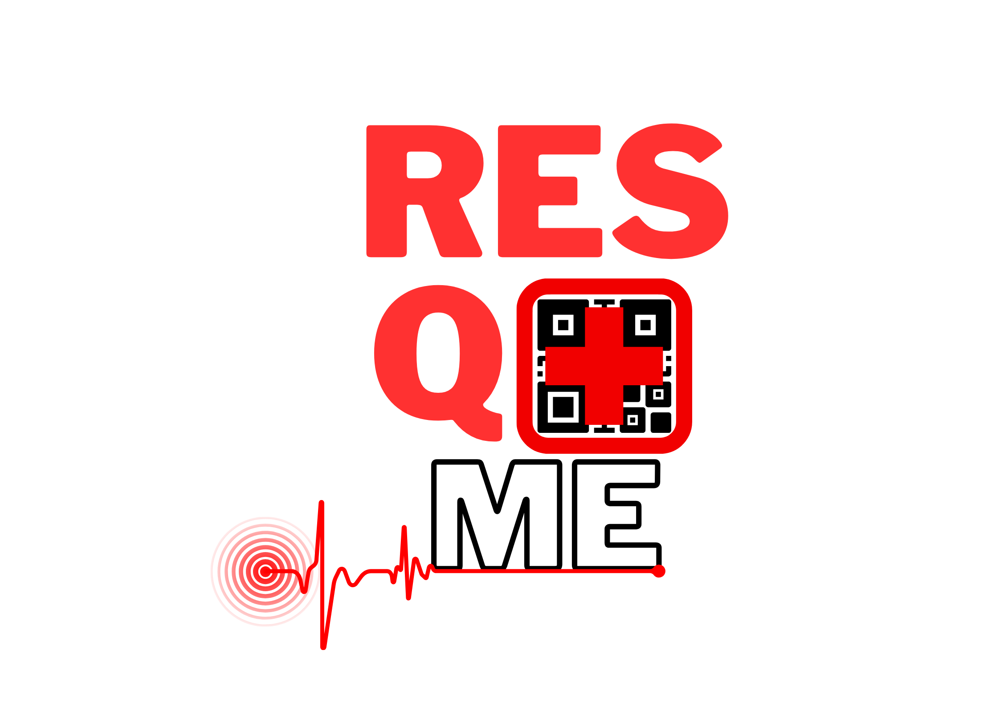

<div align="center">



# RESQ ME

**Your critical health information, reachable when time is limited.**

A student-built health-technology service that turns a short medical intake form into a scannable QR/NFC emergency profile, so first responders can see allergies, medications, and emergency contacts in seconds — without unlocking a phone or searching for paperwork.

</div>

---

## Table of Contents

- [Overview](#overview)
- [Features](#features)
- [Tech Stack](#tech-stack)
- [How It Works](#how-it-works)
- [Project Structure](#project-structure)
- [Getting Started](#getting-started)
- [Data Privacy & Compliance](#data-privacy--compliance)
- [Team](#team)
- [License](#license)
- [Contact](#contact)

---

## Overview

RESQ ME addresses the "Golden Hour" problem in emergency medicine: the minutes a responder spends trying to figure out a patient's allergies, conditions, or who to call, instead of treating them. The platform lets anyone fill out a one-time intake form with the health details that actually matter in a crisis. That submission becomes a unique **Patient ID** (`PT-YYYYMMDD-XXXXXXXX`) and a QR code linking to a read-only emergency profile page.

From there, the user can keep things fully digital (a free screenshot of their QR code) or order a physical product — a keychain or wallet card — that pairs the same QR code with an NFC chip, so a phone tap opens the profile without needing to unlock the device.

This repository contains both halves of the system:

1. **Public website** — the marketing site, patient intake form, order form, contact form, and "retrieve my QR code" form.
2. **Apps Script backend** — a Google Apps Script project that stores submissions in Google Sheets, generates QR codes, sends transactional emails, and serves the read-only patient record page that opens when a code is scanned.

> This started as a student capstone project (DIT 1-1, Group 7) at PUP — see [Team](#team).

## Features

- **Three-tier product model** — free digital QR profile, ₱100 QR + NFC keychain, ₱150 QR + NFC wallet card.
- **Conditional intake form** — allergies, medications, chronic conditions, history, insurance, and primary care provider each have a Yes/No toggle that reveals a detail field only when needed, so the form stays short for healthy users and thorough for those who need it.
- **Patient photo upload** — converted to base64 client-side and stored alongside the record (no separate file storage required).
- **Auto-generated QR codes** via the QuickChart API, rendered both in the browser and as a live formula inside the Google Sheet.
- **Patient Record Viewer** — the page a QR/NFC scan opens; pulls the record live from Google Sheets and renders it as a clean, read-only profile with a light/dark toggle.
- **Order form with live pricing** — recalculates unit price, flat shipping fee, and total as the buyer picks a product and quantity, and toggles shipping fields off for the free digital tier.
- **Resilient email delivery** — a three-step fallback chain (Brevo → Gmail/MailApp → EmailJS) so confirmation and QR-code emails still go out if one provider is rate-limited or down.
- **Retrieve QR code** — a self-service lookup that verifies Patient ID + email before re-sending a lost QR code.
- **RA 10173 consent modal** — a blocking Data Privacy Act notice shown once per session before any form can be used.
- **Light/dark theme** with `prefers-color-scheme` detection, plus a responsive mobile nav.

## Tech Stack

| Layer | Technology |
|---|---|
| Frontend | HTML5, CSS3 (custom properties for theming), vanilla JavaScript |
| Backend | Google Apps Script (serverless `doGet` / `doPost` Web App) |
| Database | Google Sheets (`Patients`, `Orders`, `Contact Messages`) |
| QR generation | [QuickChart](https://quickchart.io/) QR API |
| Transactional email | Brevo API (primary), Gmail `MailApp` (fallback), EmailJS (final fallback) |
| Fonts | Raleway, Inter, DM Sans, Syne (Google Fonts) |

## How It Works

**Registering a patient**
1. User fills out the intake form on the public site; the photo (if any) is converted to base64 in the browser.
2. The payload is `POST`ed as JSON to the Apps Script Web App.
3. The backend generates a Patient ID, appends a row to the `Patients` sheet, builds a record URL (`<web-app-url>?id=<patient-id>`), and asks QuickChart for a QR image of that URL.
4. A confirmation email (with the QR code) goes to the user, and a notification goes to the admin inbox.

**Scanning a code**
1. Scanning the QR or tapping the NFC chip opens `<web-app-url>?id=<patient-id>`.
2. `doGet` detects the `id` parameter and serves the Patient Record Viewer template instead of the JSON API response.
3. The viewer page calls `getRecord(patientId)` over `google.script.run`, looks the row up in `Patients`, and renders the fields — showing "None" for any section the patient marked No, instead of leaking an empty field.

**Ordering a physical product / contacting support / recovering a lost code**
- All three flows are separate `POST` payloads (`form_type: "order" | "contact" | "retrieve"`) routed by the same `doPost` entry point to their own sheet and email logic. Free-tier orders are auto-emailed a QR code immediately; paid orders get payment instructions and a manual confirmation step before shipping.

## Project Structure

```
resq-me/
├── index.html              # Public site: hero, shop, intake form, order form,
│                            #   promos, about, contact, retrieve-QR sections
├── style.css                # Theming (light/dark CSS variables) and layout
├── script.js                 # Form logic, conditional fields, order pricing,
│                            #   theme toggle, product image modal
├── assets/
│   ├── Logo.png
│   ├── Product1.png         # Free QR screenshot (phone mockup)
│   ├── Product2.png         # QR + NFC keychain
│   └── Product3.png         # QR + NFC wallet card
└── apps-script/
    ├── Code.gs               # doGet/doPost router, sheet I/O, QR + email logic
    └── Index.html             # Patient Record Viewer template (served on scan)
```

> The Apps Script project intentionally has its own file named `Index.html` (referenced via `HtmlService.createTemplateFromFile("Index")`). It is a different file from the root `index.html` — one is the public marketing/intake site, the other is the bare-bones page a scanned QR code opens.


### 5. Produce physical products

For the keychain/card tiers, encode each patient's record URL onto an NFC tag (a phone with NFC write support is enough for small batches) and pair it with a printed QR sticker of the same URL.

## Data Model

**`Patients` sheet**
`patient_id, created_at, full_name, sex, dob, address, phone, email, emergency_name, emergency_relationship, emergency_phone, allergies_yn, allergies, medications_yn, medications, chronic_yn, chronic_conditions, history_yn, history, insurance_yn, insurance_provider, insurance_policy, pcp_yn, pcp_name, pcp_contact, photo_base64, record_url, qr_formula`

**`Orders` sheet**
`Timestamp, Name, Patient ID, Email, Phone, Product, Quantity, Unit Price, Shipping Fee, Total, Payment Method, Address, City, Province, ZIP, Notes`

**`Contact Messages` sheet**
`Timestamp, Name, Email, Subject, Message`

All three sheets are created automatically (with a styled header row) the first time their corresponding form type is submitted.

## Product Tiers

| Product | Price | Format |
|---|---|---|
| QR Code Screenshot | Free | Digital only — QR emailed, save or print it yourself |
| QR Keychain w/ NFC | ₱100 | Acrylic keychain, printed QR + embedded NFC chip |
| QR Card w/ NFC | ₱150 | Wallet-sized PVC card, printed QR + embedded NFC chip, with a blank name field |

Paid orders add a flat ₱60 shipping fee, calculated live in the order form.

## Data Privacy & Compliance

The site shows a blocking consent modal before any form is usable, referencing the **Data Privacy Act of 2012 (Republic Act No. 10173)**. It outlines what's collected, how it's used, and the rights it's designed to support — to be informed, to access, to correct, to request erasure, and to data portability. Profile deletion requests are handled by contacting the support email; there's no self-service delete button in this version, so plan for that workflow (or build it) before relying on this for production use with real patient data.


## Team

Developed by **DIT 1-1, Group 7** at the Polytechnic University of the Philippines — Institute of Technology (PUP ITECH).

| Role | Members |
|---|---|
| CEO / Operations Lead | Markus Qriane Vallejos, Kyle Rowan Tanagon |
| CTO / Lead Developer | Kiel Anthony Villanueva, Adrian R. Tataro |
| Marketing & Customer Relations Lead | Eliana Jane Tan, Andrei John Tobias |
| Production & Logistics Coordinator | Miguel S. Traqueña, Trishia Doll Torrefiel |

## License

 all-rights-reserved by the team above.

## Contact

support@resqme.com
